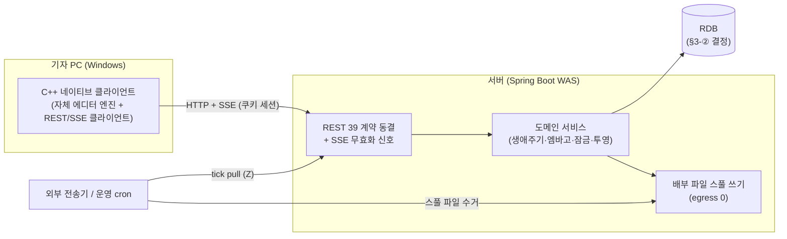

# 포팅 계획서 — C++/C 네이티브 클라이언트 + Spring WAS 서버

- **상태**: 초안 v1 (2026-08-18) — 핵심 결정 3건이 "권장안 + 대안" 형태로 열려 있음 (§3)
- **목적**: 현행 시스템(Node/Express + React SPA + Electron 접속형 셸)을 **클라이언트 = C++/C 네이티브 앱, 서버 = Spring WAS**로 재구현하는 로드맵을 정의한다.
- **근거**: 이 문서의 모든 수치는 2026-08-18 현행 HEAD 실측 인벤토리(서버 API·DB / 웹 UI·에디터 / Electron 셸 계약 / ADR 불변식 4축 병렬 조사)에서 왔다. 요구사항 정본은 `docs/news.md`(302행·31절), 스키마 정본은 `docs/SCHEMA.md`, 구현 결정 정본은 `docs/ADR.md`(ADR-001~012)다.

---

## 1. 현행 시스템 실측 요약

| 축 | 규모 |
|---|---|
| 서버 REST | **39 엔드포인트** (GET 16 / POST 19 / PUT 3 / DELETE 1) + 미들웨어 9 |
| 서버 SSE | 2 스트림(`/api/stream` 무효화 신호 · `/api/logs/stream` Z 전용 실데이터), change kind 4종 |
| DB | SQLite `news.db` 단일 파일, **7 테이블**, status **11종**, ArticleHistory eventType 6종, additive 마이그레이션 + 부트 백필 3종 |
| 서버 런타임 의존성 | **5개**(express·helmet·cors·express-rate-limit·bcryptjs) — 세션·쿠키 파싱·업로드·SSE 전부 자체 구현 |
| 웹 SPA | **12,915 LOC**(비테스트 97파일) + CSS 1,690줄, 7 라우트, 다이얼로그 17 + 인라인 모달 4 + 컨텍스트 메뉴 2, 메뉴 항목 총 93 |
| 에디터 | 자체 구현 28모듈(외부 라이브러리 0) — 블록 모델, "(끝)" 마커 계약, IME 3중 방어, 맞춤법 6규칙군, 임베드 7종, 표·diff·변환기 3종 |
| Electron 셸 | IPC 5채널, diag JSONL 18이벤트, 창 정책 fail-closed 6분기, config.json 스키마 3키 |
| 테스트 | backend **1,327**(83파일) · web **2,391**(90파일, it 블록 약 2,482) · 통합 스모크(verify-integration, CDP) |
| 환경변수 | 서버 13종 · 클라이언트 4종 |

현행 시스템은 **phase 0~66 완주·운영 가능 상태**다. 이 포팅은 결함 수정이 아니라 플랫폼 전환이며, 전환 완료까지 현행 시스템이 운영을 계속한다.

---

## 2. 목표 아키텍처



- **경계는 현행과 동일**: 2계층 HTTP-only(ADR-001 승계), 신뢰 경계는 서버, 클라이언트에 DB·백엔드 없음(접속형, ADR-011의 계약 승계).
- **REST/SSE 계약은 동결이 원칙**: 39 엔드포인트의 경로·요청/응답 shape·사유 토큰 21종·HTTP 상태 매핑을 그대로 유지한다. 계약을 동결해야 §7의 스트랭글러 전환(기존 클라 ↔ 새 서버 교차 검증)이 성립한다.
- 브라우저 접속 공존 여부는 열린 질문(§10). 유지하면 기존 SPA 서빙도 Spring이 승계(정적 리소스), 폐기하면 C++ 클라 전용 API 서버가 된다.

---

## 3. 핵심 결정 3건 (결정 필요 — 각 권장안으로 가정하고 로드맵 작성)

### ① C++ UI 프레임워크 — 권장: **Qt 6 (LGPL 동적 링크)**

| 안 | 평가 |
|---|---|
| **Qt 6 (권장)** | 리치 텍스트 위젯(QTextDocument/커스텀 QAbstractScrollArea)·한글 IME(QInputMethodEvent)·인쇄(QPrinter)·국제화가 전부 프레임워크 제공. 에디터 재구현 비용 최소. LGPL 동적 링크로 무료 사용 가능(배포 폴더에 DLL 동봉 — 현행 "무설치 폴더" 배포 방식과 호환). |
| Win32 + Direct2D 순수 네이티브 | 의존성 0·최소 배포. 그러나 §5의 에디터·IME(WM_IME_* 직접 처리)·인쇄 페이지네이션을 전부 손으로 구현 — 체감 공수 3~5배. 요구가 "의존성 최소"보다 "완성"이면 비권장. |
| MFC | VS 통합은 좋으나 리치 에디터는 결국 직접 구현(CRichEditCtrl은 이 블록 모델·색상 계약에 부적합). Qt 대비 이점 없음. |
| (범위 축소 대안) C++ 셸 + WebView2 | 기존 SPA를 WebView2로 띄우는 접속형 셸 — 사실상 Electron의 경량 대체이며 에디터 재구현이 0이 된다. 단 "클라이언트를 C++/C로 구현"이라는 요청 취지(네이티브 에디터)와 다르므로 **비용 절감 escape hatch로만 병기**. |

### ② DB — 권장: **MariaDB(또는 MySQL)로 이전**

| 안 | 평가 |
|---|---|
| **MariaDB/MySQL (권장)** | Spring 표준 조합(JDBC/MyBatis·커넥션 풀·동시성). 현행의 "단일 프로세스 + busy_timeout + 인스턴스 잠금(ADR-012)" 제약이 DB 서버의 동시성으로 자연 해소. `news.db` → 전환 마이그레이터를 P2에서 제작(비파괴 검증 게이트 필수 — §8). |
| SQLite 유지 | 데이터 이전 0(파일 그대로 JDBC). 그러나 Spring+SQLite는 비표준 조합이고 커넥션 풀·동시 쓰기 이점을 포기 — WAS 채택 의의가 반감. 소규모 단독 배치가 확정이면 재고 가능. |
| PostgreSQL | MariaDB 동급. 팀 운영 경험이 있는 쪽을 선택하면 됨. |

**어느 안이든 불변**: "DB에 있는 내용은 절대 삭제하지 않는다"(5개 문서 중복 명문화된 최상위 규칙) — 이전 도구는 읽기 전용 소스 + 신규 대상 쓰기로 설계하고, 원본 `news.db`는 이전 후에도 보존한다. 스키마 변경은 additive만(Flyway 채택 시에도 DROP/DELETE 마이그레이션 금지 규율 유지).

### ③ 전환 전략 — 권장: **서버 선행 스트랭글러**

```
P1~P3: Spring이 REST/SSE 계약을 그대로 구현
        → 기존 웹 SPA·Electron 클라가 "그대로" 새 서버에 붙어 운영 검증 (패리티 게이트)
P4~P7: 안정된 Spring 서버 위에서 C++ 클라이언트 개발·교체
```

- 최대 리스크(에디터 재구현)를 안정된 서버 위에서 진행하고, 단계마다 되돌릴 수 있다.
- 빅뱅(동시 재구현 후 일괄 전환)은 총 기간은 짧을 수 있으나 검증 기준점이 없어 비권장.
- 이 전략이 성립하는 전제가 **§2의 API 계약 동결**이다.

---

## 4. 유지해야 할 불변식 (포팅 후에도 참인 규칙)

실측 조사에서 확정한 최우선 이식 대상 8건:

1. **DB 비파괴** — 행 삭제 0, soft delete(`active='N'`)만, 멱등·additive 마이그레이션만. ArticleHistory는 append-only(유일한 UPDATE 예외 = NULL snapshotTitle 백필).
2. **신뢰 경계 = 서버 + 매 요청 신원 재도출** — acting role은 세션에서만, 매 요청 User 행 재조회로 비활성·강등 즉시 반영(캐시·TTL 금지). 클라이언트가 보낸 role·시각·대상 목록 불신(tick은 body를 읽지 않는다).
3. **SSE는 행 데이터 없는 무효화 신호** — kind 4종(create/update/status/lock)만, 클라이언트가 자기 권한으로 재조회. push 시점 **비연장(peek)** 재검증. 예외는 로그 스트림(Z 전용) 하나.
4. **배부 = 파일 스풀 outbound + 외부 tick pull** — 앱 내 주기 타이머 0, 네트워크 egress 0, 자동 재시도·백오프·큐 0. 복구는 Z의 명시 재전송뿐(stale-cycle 거부). Spring의 `@Scheduled`/`@Retryable`/메시지 큐 도입 유혹과 정면 충돌하는 지점 — **ADR-008을 Spring 환경으로 재서명해 명문 이식**한다.
5. **응답 투영 단일 지점** — `lockerSessionId`·`lockerClientId`는 어떤 응답에도 싣지 않는다. Spring에서는 DTO 계층이 그 단일 지점(엔티티 직접 직렬화 금지).
6. **수집 fail-closed** — loopback 밖 바인딩 + 토큰 미설정이면 수집 라우트 503. 미등록 주체는 최제한 취급.
7. **런타임 탐지보다 명시 주입** — 패키지 여부·경로 해석·정책 판정은 순수 함수 단일 출처(현행 `resolveRuntimePaths`·`embargoPolicy` 방식). Spring에서는 프로파일·설정 주입으로 동형 구현.
8. **게이트 문화** — TDD red 실증 → 변이 검증 → 기준선 산술(감소·skip 0) → flake는 재실행 2회 연속 green 판정 → 미검증의 정직한 기록(forward_notes).

**ADR-001~012 처분 요약**: 승계 = 001(경계)·003(모델 계약)·004(인가 정책)·005(SSE)·006(계층)·007(로그 정책)·008(배부)·011(클라 보안 정책) / 재검토 = 002(ORM 회피 근거 약화 — 마이그레이션 규칙만 승계)·009(CSRF — Spring Security 토큰 기본 제공이라 재평가)·012(공유 세션 스토어로 가면 제약 자체 소멸) / 소멸 = 010(SEA — 단, "런타임 설치 불필요·데이터는 실행 파일 옆·cwd 비의존" 3계약은 승계).

---

## 5. 최대 리스크 — 에디터 네이티브 재구현 (전체 일정의 지배 항)

웹 코드 LOC로 산정하면 **과소평가**된다: 브라우저가 공짜로 주던 것(캐럿·선택·줄바꿈·IME·클립보드·레이아웃·인쇄)을 전부 직접 구현해야 하고, 현행 `Editor.jsx`(740줄)의 절반은 오히려 브라우저를 "길들이는" 방어 코드라 네이티브에선 무의미해진다.

| 리스크 축 | 내용 | 대응 |
|---|---|---|
| ① 텍스트 엔진 | contentEditable 대체 — 캐럿/선택/히트테스트/스크롤/줄 레이아웃 직접 구현 | Qt 채택으로 흡수(P0 스파이크에서 go/no-go) |
| ② 한글 IME | 조합 중 무개입 원칙(단축키 인터셉트 포기·재색칠 금지·캐럿 튐 방지) — 웹 3줄이 네이티브 수백 줄 | **P0 스파이크 필수 항목**. 조합 중 캐럿 튐은 기자가 즉시 체감하는 결함 |
| ③ "(끝)" 마커 계약 | substring/trim 두 판정 기준 공존, 위반 시 오염 본문이 송고·배부(비가역) | 순수 로직은 1:1 이식하되, **모든 입력 경로**(타이핑/Enter/붙여넣기/드롭/IME/치환/정렬/약물/날짜)가 이 게이트를 경유함을 계약 테스트로 잠금 |
| ④ 문자 단위 스타일 런 | 줄 역할 색 4종 + 맞춤법 하이라이트 span(bold/underline) 오버레이 | Qt 스타일 런 모델로 매핑 |
| ⑤ 임베드 인라인 7종 | 텍스트 흐름 안 이미지/표/오디오/비디오는 Qt로 가능하나 **YouTube iframe은 네이티브 대체 불가** | YouTube만 WebView2/QWebEngine 부분 임베드 또는 "썸네일+외부 브라우저 열기"로 스펙 조정(열린 질문 §10) |
| ⑥ 인쇄 | HTML `document.write`+`print()` → QPrinter 페이지네이션 전면 재설계 | 상세보기 HTML 생성기(`articleDetail.js` 223줄)의 필드 규칙을 명세로 재사용 |
| ⑦ WriterPage 상태 기계 | 2,177줄·useState 55개(다중 탭×잠금×자동저장×undo×다이얼로그 배타) | 명령형 상태 머신으로 재설계 — 현행 테스트가 동작 명세 |

**이식 가능한 자산(비용 절감 요인)**: 순수 계산 모듈 약 **2,200 LOC(전체의 17%)** — 블록 직렬화·찾기바꾸기·맞춤법 스캐너·undo 스택·LCS diff·변환기 3종(113종목·38쌍)·표 모델·EUC-KR 근사·키 파서·URL 검증·버튼 진리표·메타 택소노미 — 는 로직 1:1 이식이 가능하고, 대응하는 웹 테스트(약 2,482 it 블록)가 **명세서 겸 회귀 스위트**로 전환된다.

---

## 6. 시스템별 설계 매핑

### 6.1 서버: Express → Spring Boot

| 현행 | Spring 대응 | 주의 |
|---|---|---|
| `server/index.js` 얇은 transport + controllers→services→models | `@RestController` → `@Service` → Repository | ADR-006과 동형 — 계층 규율 그대로 |
| in-process Map 세션(sid 64-hex, 1h 슬라이딩, 로그인 시 기존 세션 전멸) | Spring Session(초기: 인메모리 단일 노드 → 필요 시 Redis) | **매 요청 User 재도출(sessionGuard)은 프레임워크 기본이 아니다** — 필터로 직접 이식 |
| 편집 잠금(Contents 5컬럼, clientId 단위, TTL 30분, 재로그인 takeover) | 동일 스키마·동일 규칙의 도메인 서비스 | DB 행 기반이므로 이식 용이. `x-edit-client` 헤더 계약 유지 |
| SSE(EventEmitter → res.write, 종결자 `\n\n`, unauthorized 프레임) | `SseEmitter` + 애플리케이션 이벤트 | push 시점 비연장 재검증·행 데이터 없음 계약 유지 |
| CSRF Origin/Referer allowlist(ADR-009) | Spring Security로 재평가 — 토큰 방식 채택 가능 | 재평가하되 "동일 출처 배포 + 미설정 시 부트 진단 로그" 불변식은 유지 |
| bcrypt(cost 10)·로그인 잠금(5회/15분, 423)·rate limit(15분/10회) | Spring Security PasswordEncoder + 동일 정책 직접 구현 | 423 Locked 등 **HTTP 상태 매핑 21토큰 표를 계약으로 동결** |
| 업로드(base64 JSON, 확장자 14종, 5MB, hex 파일명, `wx` 플래그) | MultipartFile이 아니라 **동일 base64 계약 유지**(클라 호환) | 전환 완료 후 multipart 전환은 별도 판단 |
| 스풀 쓰기(tmp→rename 원자적, 슬러그 검증, allowlist 18필드) | java.nio 동일 패턴 | 필드 allowlist·`internalComment` 제외 계약 동결 |
| additive 마이그레이션 + 부트 백필 3종 | Flyway(additive만 — DROP/DELETE 마이그레이션 금지 규율) | 백필은 멱등 마이그레이션으로 이식 |
| `node:sqlite` 직접 SQL | MyBatis(SQL 가시성 유지 — 현행 "직접 SQL" 철학과 근접) 또는 JPA | ORM 채택 시에도 상태 전이표(`lifecycle.js`)·엠바고 정책(`embargoPolicy.js` 207줄 순수 모듈)은 **테이블 주도 순수 로직으로 이식**(news.md 268~288행이 정본) |
| 외부 API 프록시(media/translate) | RestClient | API 키는 서버 측 유지(클라 미노출) 동일 |

**계약 동결 산출물(P1 선행 작업)**: ① 39 엔드포인트 × 요청/응답 shape + 사유 토큰 + 상태 코드의 명세화(OpenAPI) ② 그 명세를 검증하는 **프레임워크 중립 계약 테스트 스위트**(HTTP 레벨) — 같은 스위트를 Node 서버와 Spring 서버에 이중 실행해 패리티를 기계 판정한다.

### 6.2 클라이언트: Electron 셸 + SPA → Qt 네이티브

**Electron 셸 계약의 처분** (실측 분류):

| 소멸(브라우저 개념) | 이식 필수 |
|---|---|
| secure-origin 스위치 전체(네이티브는 OS 클립보드 직접 호출) | 서버 주소 프로브: `/api/health` 본문 `{ok:true}` 판정 + 리다이렉트 최종 origin 승격 + fail-safe(하향 미승격 포함) |
| 권한 핸들러 2종(clipboard) | config 파일: 스키마 화이트리스트·tmp→rename 원자적 쓰기(`%APPDATA%\기사작성기\config.json` 유지 가능) |
| preload/contextBridge·sender 검증(프로세스 경계 소멸) | diag JSONL: 이벤트 이름·필드·금지 키 7종 유지(→ 검증 자동화 재사용, 렌더러 계열 4이벤트만 재매핑) |
| resources/app 위생 게이트(단일 exe라 대상 소멸) | 단일 인스턴스(named mutex), 창 bounds 저장(close 시 1회·workArea 교차 판정), 메뉴 단축키 비충돌 규율 |
| 창 2종 분리·window.open 정책 | 상세보기 새 창(720×800)은 네이티브 창으로 동형 구현. 외부 링크는 기본 브라우저로 |

**앱 구조(제안)**:

```
클라이언트 (Qt 6, C++17 이상)
├─ core/       순수 로직 이식층 (블록 모델·마커·찾기·맞춤법·변환기·diff·정책)  ← 웹 '하' 등급 1:1
├─ net/        REST 클라이언트(35 계약 메서드) + SSE 파서 + 쿠키 세션      ← httpModel 계약 이식
├─ editor/     텍스트 엔진(스타일 런·캐럿·IME·임베드 인라인·undo)          ← 최대 공수
├─ ui/         7화면 + 다이얼로그 17종 + 메뉴 93항목 + i18n 154키
└─ shell/      config·diag·단일 인스턴스·프로브·인쇄
```

`model/contract.js`의 35 메서드 계약과 `fakeModel`(357줄) 패턴을 C++ 인터페이스 + 목 구현으로 이식하면 화면 개발이 서버 없이 진행 가능하다(ADR-003 승계).

---

## 7. 단계별 로드맵

각 phase는 현행 하네스 관행(② 계획 검토 → ③ TDD 구현 → ④ 테스트 게이트 → ⑤ 코드리뷰)을 그대로 적용한다.

| Phase | 내용 | 완료 게이트(AC) |
|---|---|---|
| **P0 스파이크 2건** (병렬) | (a) Spring: 세션 쿠키 + SSE + 대표 엔드포인트 3개 패리티 미니 서버 (b) **Qt 에디터 코어 go/no-go**: 블록 렌더·줄 색상·한글 IME 조합·"(끝)" 마커 차단·캐럿 복원만 담은 스파이크 | (a) 기존 웹 SPA가 로그인·목록·SSE 갱신 동작 (b) 한글 조합 중 캐럿 튐 0·마커 뒤 입력 차단 실기 확인. **no-go면 §3-① 재결정(WebView2 하이브리드 부상)** |
| **P1 Spring 서버 API 패리티** | 39 엔드포인트 + SSE 2 + 도메인 로직 전량(생애주기 전이표·엠바고 2축·잠금·투영·수집·배부 스풀·tick·실패 원장) | **계약 테스트 스위트를 Node/Spring 이중 실행해 전 항목 동일 판정** + 상태 전이·엠바고는 news.md 268~288/259~267행 기준 전수 케이스 |
| **P2 DB 이관** | `news.db` → MariaDB 마이그레이터(읽기 전용 소스·전 행 대조 검증), Flyway 기반선 | 전 테이블 행 수·전 컬럼 값 대조 100% + 원본 파일 무변 + 역방향(참조용 export) 경로 확보 |
| **P3 서버 전환 운영** | 기존 웹 SPA + Electron 클라를 Spring에 접속시켜 병행 운영 → Node 서버 은퇴 | 실운영 시나리오(작성→송고→배부→수집) 통과, 배부 스풀 산출물 바이트 대조, 운영 cron tick 전환 |
| **P4 C++ 클라 골격** | Qt 앱 골격 + shell 계약(프로브·config·diag·단일 인스턴스·bounds) + net 계층(REST 35 + SSE) + 로그인/목록 화면 | 로그인→목록 SSE 실시간 갱신 실기 + diag 이벤트로 자동 검증(기존 verify 스크립트 계약 재사용) |
| **P5 에디터 코어** | 텍스트 엔진·블록 모델·마커 계약·단축키 13종·IME·색상·undo·자동저장 | 순수 모듈 이식분은 기존 웹 테스트 케이스를 C++ 테스트로 전환해 green, IME·캐럿은 실기 체크리스트 |
| **P6 에디터 확장** | 임베드 7종(YouTube는 §10 결정 반영)·맞춤법+하이라이트·찾기바꾸기·표·인쇄(QPrinter)·다이얼로그 17종·환경설정 8탭 | 기능축별 대조 체크리스트(웹 대비 동작 동일성), 인쇄 출력물 육안 대조 |
| **P7 관리/조회 화면 완성** | 조회 6메뉴·컬럼 설정·우클릭 14액션·상세보기 창·관리 4화면(Z) | 권한(R/D/Z)×상태(11종)×잠금 매트릭스 전수 테스트(버튼 진리표 이식분으로 기계 판정) |
| **P8 통합·전환** | 통합 스모크(서버+클라 실기 자동화)·병행 배포(PC별 폴더 교체)·Electron 은퇴 | 육안 체크리스트 개정판 통과, 롤백 절차 문서화 |

**되돌림 지점**: P3 완료 전 문제 시 Node 서버로 즉시 복귀(클라 무변경). P4~P7 중에는 Electron 클라가 상시 대체재(서버는 이미 Spring).

---

## 8. 검증 전략

- **계약 테스트가 척추**: P1의 프레임워크 중립 HTTP 스위트가 전 과정의 회귀 기준. 현행 backend 테스트 1,327건은 Node 구현에 결합돼 있어 직접 재사용은 안 되지만, 그 단언 내용이 계약 스위트의 케이스 원천이다.
- **웹 테스트 = 명세서**: web 2,391건 중 순수 모듈 테스트는 C++ 이식분의 명세 겸 회귀 스위트로 전환한다(입출력 테이블 추출).
- **이중 실행 패리티**: P1~P3 동안 같은 요청을 Node/Spring에 동시 재생해 응답 diff 0을 기계 판정(사유 토큰·상태 코드·투영 필드 포함).
- **DB 이관 검증**: 전 행 대조 + 원본 보존 + "삭제 쿼리 0" 정적 검사(마이그레이터 코드에 DELETE/DROP 부재를 텍스트 잠금).
- **게이트 문화 승계**: red 실증·변이 검증·기준선 산술·flake 2회 재실행 규약·미검증 정직 기록 — 현행 하네스 관행 그대로.
- **육안 게이트**: 자동 판정 불가 항목(IME 체감·인쇄 출력·클립보드 실사용·SmartScreen)은 현행 `packaging/체크리스트-육안확인.md` 방식의 개정판으로 분리.

---

## 9. 규모·공수 감각 (상대치 — 절대 기간은 인력 확정 후 산정)

| 작업 덩어리 | 상대 규모 | 근거 |
|---|---|---|
| Spring 서버 패리티(P1) | **중** | 로직은 전부 명세화돼 있음(39 엔드포인트·전이표·엠바고 순수 모듈 207줄·토큰 21종). 프레임워크가 세션·보안·SSE를 제공 |
| DB 이관(P2) | 소 | 7테이블, 도구 + 검증 게이트 |
| C++ 클라 — 에디터(P5~P6) | **대 (전체의 절반 이상)** | §5 — 웹 LOC 5,300(41%)이 네이티브에서 증폭되는 구간. Qt 채택이 이 증폭을 얼마나 흡수하는지가 P0 (b)의 판정 대상 |
| C++ 클라 — 화면/관리(P4·P7) | 중 | 위젯 매핑은 기계적, 매트릭스 이식이 본체 |
| 순수 모듈 이식 | 소 | 약 2,200 LOC 1:1 + 테스트 전환 |
| 통합·전환(P3·P8) | 소~중 | 자동화 자산(verify 계열·diag 계약) 재사용 |

---

## 10. 열린 질문 (결정 대기)

1. §3 핵심 결정 3건(UI 툴킷 / DB / 전환 전략) — 본 문서는 권장안(Qt 6 · MariaDB · 서버 선행) 가정으로 작성됨.
2. **브라우저 접속 공존 여부** — 유지하면 웹 SPA도 계속 보수(이중 클라이언트), 폐기하면 C++ 클라가 유일 접점(현행 "화면 변경은 서버 재배포만으로 전파" 이점 소멸).
3. **YouTube 임베드** — 네이티브 대체 불가. QWebEngine/WebView2 부분 임베드 vs 썸네일+외부 브라우저로 스펙 조정.
4. 다국어 문서 언어 9종(현행 prefs) 중 실사용 범위 — 네이티브 폰트·조판 검증 범위가 달라짐.
5. Spring 채택 시 로그 정책 — 현행 "파일 미저장·링 버퍼 10,000·Z 전용 SSE"(ADR-007)를 유지할지, WAS 관행(파일 로그+로테이션)으로 갈지. 로그 마스킹 규율(`docs/LOGS.md`)은 어느 쪽이든 승계.
6. 세션 스토어 — 단일 노드 인메모리로 시작할지, 처음부터 공유 스토어(Redis)로 갈지(ADR-012 제약의 존폐와 연동).
7. `ContentsVO.md` — news.md가 참조하나 리포에 부재. 포팅 전 원본 확보 필요.
8. news.md 드리프트 2건 정리 — 301행 CORS 서술(현행은 ALLOWED_ORIGINS 체계), 174행 spellcheck=true(ADR-011이 셸 한정 무효화). **포팅 요구사항 정본으로 쓰기 전에 "ADR이 news.md를 덮어쓴 지점" 목록을 확정**해야 한다.

---

## 부록 A. REST 계약 동결 목록 (39 — P1 패리티 체크리스트)

인증 표기: 공개 / 세션 / 세션+R/D/Z(기자·데스크·관리자) / Z / 토큰(x-collection-token).

| # | METHOD 경로 | 인증 | 용도 |
|---|---|---|---|
| 1 | GET /api/health | 공개 | 헬스체크 `{ok:true}` |
| 2 | POST /api/login | 공개(15분/10회) | 세션 발급 + `sid` 쿠키 |
| 3 | POST /api/logout | 공개 | 세션 무효화 |
| 4 | GET /api/session | 세션 | F5 세션 복원 |
| 5 | GET /api/users | 세션 | Z=전체, 그 외 4필드 투영 |
| 6 | POST /api/users | Z | 사용자 생성 |
| 7 | PUT /api/users/:id | Z | 사용자 수정 |
| 8 | GET /api/receiver-config | Z | 수집 수신 설정 목록 |
| 9 | POST /api/receiver-config | Z | 수집 수신 설정 생성 |
| 10 | DELETE /api/receiver-config/:id | Z | 설정 행만 삭제(기사 불변) |
| 11 | GET /api/distribution-targets | Z | 배부 수신처 목록 |
| 12 | POST /api/distribution-targets | Z | 배부 수신처 생성 |
| 13 | PUT /api/distribution-targets/:id | Z | 배부 수신처 수정 |
| 14 | POST /api/distribution-targets/:id/deactivate | Z | soft delete |
| 15 | POST /api/distribution/tick | Z | 엠바고 도래분 배부 1회(body 무시) |
| 16 | GET /api/distribution/failures | Z | 미해소 실패 목록 |
| 17 | POST /api/distribution/retry | Z | historyId 1건 재전송 |
| 18 | GET /api/articles/search | 세션 | 전문 검색 |
| 19 | GET /api/articles | 세션 | 목록(필터 15키 화이트리스트) |
| 20 | GET /api/articles/:id | 세션 | 단건(본문 포함) |
| 21 | GET /api/articles/:id/history | 세션 | 이력 목록 |
| 22 | GET /api/articles/:id/history/:historyId | 세션 | 이력 스냅샷 단건 |
| 23 | POST /api/articles | 세션+R/D/Z | 신규 저장 |
| 24 | POST /api/articles/:id/action | 세션+R/D/Z | send/hold/kill/approveDelete 전이 |
| 25 | POST /api/articles/:id/derive | 세션+R/D/Z | followUp/continue 파생 |
| 26 | POST /api/articles/:id/translate | 세션 | 외부 번역 프록시 |
| 27 | PUT /api/articles/:id | 세션+잠금 보유자 | 부분 수정 |
| 28 | POST /api/articles/:id/lock | 세션(DPS는 D) | 편집 잠금 획득 |
| 29 | POST /api/articles/:id/unlock | 세션+보유자 | 잠금 해제(멱등) |
| 30 | POST /api/articles/:id/force-unlock | 세션+D/Z | 강제 해제 |
| 31 | GET /api/media/search | 세션 | YouTube/이미지 검색 프록시 |
| 32 | POST /api/upload | 세션 | base64 업로드(14확장자·5MB) |
| 33 | POST /api/photos | 세션 | 사진DB 등록(append-only) |
| 34 | GET /api/photos/search | 세션 | 캡션 검색 |
| 35 | POST /api/collection/receive | 토큰·loopback | 수집 push |
| 36 | POST /api/collection/pull | 토큰·loopback | 수집 pull |
| 37 | GET /api/stream | 세션 | SSE 무효화 신호 |
| 38 | GET /api/logs/digest | Z | 24h(06:00 정렬) 로그 다이제스트 |
| 39 | GET /api/logs/stream | Z | SSE 실시간 로그 |

**부수 계약**: 사유 토큰→HTTP 상태 매핑 21종(401/403/404/400/409/500/503) · SSE change kind 4종 · 허용 헤더 4종(`Content-Type, x-session-id, x-collection-token, x-edit-client`) · 업로드 응답 `/uploads/<hex>.<ext>` 경로 형식 · 본문 직렬화 `{format:'yh-editor',version:1,blocks:[]}`.
